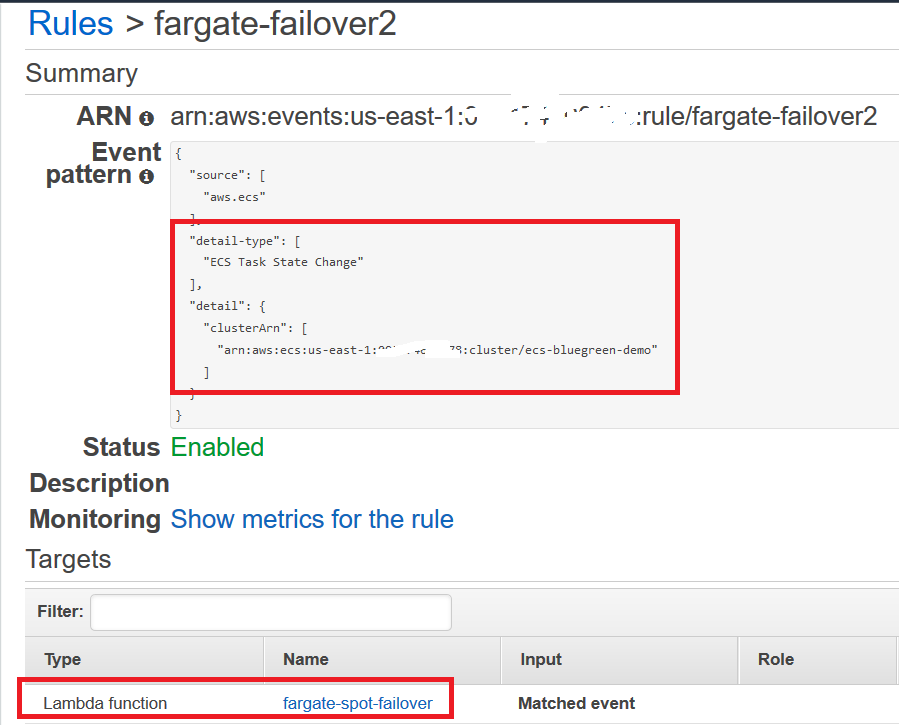
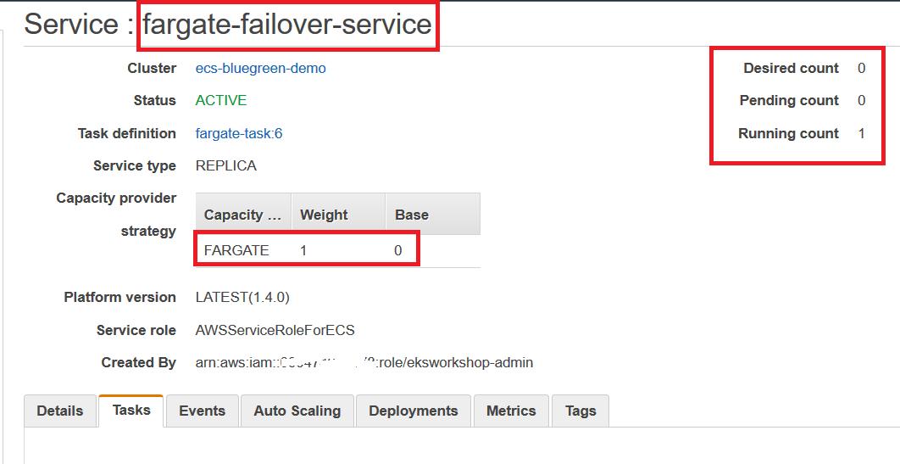

#  Spot to On-demand failover solution for Amazom ECS workloads with Fargate and EC2 Capacity Providers

This solution implements failover from Fargate Spot to Fargate when there is no Spot capacity and switched back from Fargate to Fargate Spot when spot capacity is back

This can used even for EC2 Capacity Provders as well. Replace FARGATE and FARGATE_SPOT with EC2 capacity providers. Also this solution can be easily scaled to work with multiple services.

This is the overall architecture


##  Set Network configuration

```bash
export SUBNETS="subnet-764d7d11 subnet-a2c2fd8c subnet-cb26e686"
export SECURITY_GROUP="sg-4f3f0d1e"
export VPC="vpc-de3874a4"
export AWS_REGION="us-east-1"
```
##  Create ECS Cluster

```bash
aws ecs create-cluster \
     --cluster-name ecs-bluegreen-demo \
     --region $AWS_REGION
```
"clusterArn": "arn:aws:ecs:us-east-1:XXXXXX:cluster/ecs-bluegreen-demo",
"clusterName": "ecs-bluegreen-demo",

##  Create ALB

```bash
aws elbv2 create-load-balancer \
     --name ecs-fargate-demo \
     --subnets $SUBNETS \
     --security-groups $SECURITY_GROUP \
     --region $AWS_REGION
```
"LoadBalancerArn": "arn:aws:elasticloadbalancing:us-east-1:XXXXXX:loadbalancer/app/ecs-fargate-demo/934be3315839ef1b",
"DNSName": "ecs-fargate-demo-640287318.us-east-1.elb.amazonaws.com",

## Create Target Group

```bash
aws elbv2 create-target-group \
     --name ecs-fargate-demo \
     --protocol HTTP \
     --port 80 \
     --target-type ip \
     --vpc-id $VPC \
     --region $AWS_REGION

export TARGET_GROUP="arn:aws:elasticloadbalancing:us-east-1:XXXXXX:targetgroup/ecs-fargate-demo/e699f5c5d7141ac7"

```
 "TargetGroupArn": "arn:aws:elasticloadbalancing:us-east-1:XXXXXX:targetgroup/ecs-fargate-demo/e699f5c5d7141ac7",
"TargetGroupName": "ecs-fargate-demo",

## Create a listener for the ALB

```bash
aws elbv2 create-listener \
     --load-balancer-arn arn:aws:elasticloadbalancing:us-east-1:XXXXXX:loadbalancer/app/ecs-fargate-demo/934be3315839ef1b \
     --protocol HTTP \
     --port 80 \
     --default-actions Type=forward,TargetGroupArn=arn:aws:elasticloadbalancing:us-east-1:XXXXXX:targetgroup/ecs-fargate-demo/e699f5c5d7141ac7 \
     --region $AWS_REGION
```

 "ListenerArn": "arn:aws:elasticloadbalancing:us-east-1:XXXXXX:listener/app/ecs-fargate-demo/934be3315839ef1b/0607228587549ece",

## Atatch FARGATE and FARGATE_SPOT capacity providers to the cluster with a default capacity provider strategy.

```bash
aws ecs put-cluster-capacity-providers   \
        --cluster ecs-bluegreen-demo  \
        --capacity-providers FARGATE FARGATE_SPOT  \
         --default-capacity-provider-strategy capacityProvider=FARGATE,base=1,weight=1  capacityProvider=FARGATE_SPOT,weight=3 \
         --region $AWS_REGION

```

## Register a Fargate Task

```bash
aws ecs register-task-definition   --cli-input-json file://fargate-task.json
```

## Register a Fargate Service for the application with required capacity provider Strategy

```bash
export SECURITY_GROUP="sg-4f3f0d1e"
export PUBLIC_SUBNET_LIST="subnet-764d7d11,subnet-a2c2fd8c,subnet-cb26e686"

aws ecs create-service \
     --capacity-provider-strategy capacityProvider=FARGATE,base=1,weight=1 capacityProvider=FARGATE_SPOT,weight=3 \
     --cluster ecs-bluegreen-demo \
     --service-name fargate-service \
     --load-balancer targetGroupArn=$TARGET_GROUP,containerName=fargate-task,containerPort=80 \
     --task-definition fargate-task:6  \
     --desired-count 5\
     --region us-east-1 \
     --network-configuration "awsvpcConfiguration={subnets=[$PUBLIC_SUBNET_LIST],securityGroups=[$SECURITY_GROUP],assignPublicIp="ENABLED"}"
```

##  Create a failover ECS service with FARGATE capacity provider with same Targer Group as the original service

```bash
aws ecs create-service \
     --capacity-provider-strategy capacityProvider=FARGATE,weight=1 \
     --cluster ecs-bluegreen-demo \
     --service-name fargate-failover-service \
     --load-balancer targetGroupArn=$TARGET_GROUP,containerName=fargate-task,containerPort=80 \
     --task-definition fargate-task:6  \
     --desired-count 0\
     --region us-east-1 \
     --network-configuration "awsvpcConfiguration={subnets=[$PUBLIC_SUBNET_LIST],securityGroups=[$SECURITY_GROUP],assignPublicIp="ENABLED"}" 

```

##  Create a lambda using the code in the file  lambda_function.py


##  Configure Fargate Failover Service in Lambda


##  Configure Fargate Failover Service in Lambda


##  Create a cloud watch event rule for SERVICE_TASK_PLACEMENT_FAILURE

##  Create a cloud watch event rule for Task State Change


##  Create a Lambda test event for SERVICE_TASK_PLACEMENT_FAILURE
Use sample json from the file TaskFailureEvent.json


##  Create a cloud watch event rule for Task State Change
Use sample json from the file task-state-change-running.json


##  Simulate TaskFailureEvent


##  Fargate Failover Service create a new On-demand Task


##  Target Group registers new On-demand task


##  Simulate TaskStateEvent


##  Fargate Failover Service delete new On-demand Task



##  Target Group deregisters new On-demand task


