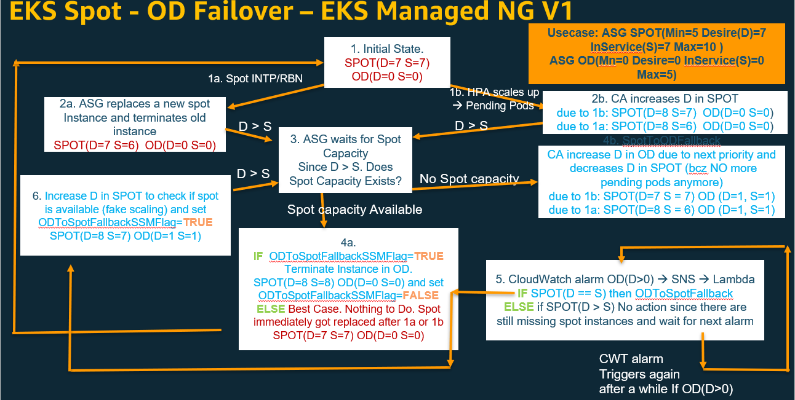

#  Spot to On-demand failover solution for Amazom EKS workloads 

This solution implements failover from Spot to OD when there is no spot capacity available and from OD to Spot fall back


This is the overall architecture




# Setting up multiple Managed Spot Node groups on EKS

1. Set up the AWS Environment as per below link
https://www.eksworkshop.com/020_prerequisites/
2. Create an EKS Cluster as per below link
https://www.eksworkshop.com/030_eksctl/
3. Create Spot Managed Node groups
  The folder node-group-configs contains configs for 12 node groups
  4 node groups for 3 different application type (compute, general and memory)
  4 node groups consists of 3 Spot node groups (for more diversification) and 1 On-demand node group
  Compute node groups for all K8s services whose pod vcpu:memory ratio is close to 1:2
  General node groups for all K8s services whose pod vcpu:memory ratio is close to 1:2
  Memory node groups for all K8s services whose pod vcpu:memory ratio is close to 1:2

  replace the following in each of these 12 files
      EKS cluster name as per your environment
      VPC and Subnet Ids
      node group labels/taints/tags
      aws region
  
```bash
cd node-group-configs
#run below command for each of 12 node groups
eksctl create nodegroup -f <nodegroup-config-yaml>
```
4. deploy custor auto scaler (CA)

replace the following in cluster_autoscaler-priority.yml
      EKS cluster name as per your environment
      AWS region

replace the following in cluster-autoscaler-priority-expander.yaml
      ASG group names (NOT node group names)
      adjust priority if needed for your environment

Note CA is configured to deployed on On-Demand Node group created as part of the EKS cluster creation in Step2
CA needs to access EC2 Auto Scaling Group (ASG) service to scale up/down the instances
So it needs IAM permissins. Add the below IAM policy to the Node group Role for on-demand node group
arn:aws:iam::aws:policy/AutoScalingFullAccess
You can find the Node group role ARM in the EKS console -> configuration -> Compute
click on node group names 'nodegroup'
It looks like
arn:aws:iam::000474600478:role/eksctl-eksworkshop3-nodegroup-nod-NodeInstanceRole-1F8KNY1G26SIK

      nodeSelector:
        alpha.eksctl.io/nodegroup-name: nodegroup 

Please note there is a better way IRSA (IAM Role for ServiceAccount) to control fine grained access to pods. We will look into this later in production.

```bash
cd cluster-autoscaler
kubectl apply -f cluster-autoscaler-priority-expander.yaml
kubectl apply -f cluster_autoscaler-priority.yml
```
5. Deply Apps

There are 3 apps in example-apps folder one for each app type
Change the node labels as per node group labels configured above

Check if CA scaled the node groups and pods are deployed successfully

pls ignore the testing folder 

6. Install Helm
https://www.eksworkshop.com/beginner/060_helm/

7. Deploy Prometheus and Grafana as per below link
https://www.eksworkshop.com/intermediate/240_monitoring/
8. Deploy EFK stack
https://www.eksworkshop.com/intermediate/230_logging/
9. Deploy ArgoCD 
https://www.eksworkshop.com/intermediate/290_argocd/

